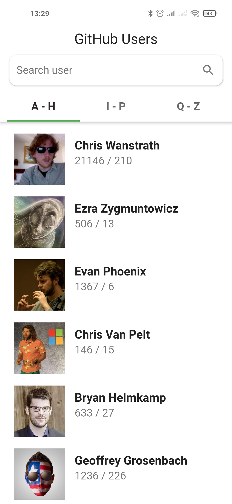
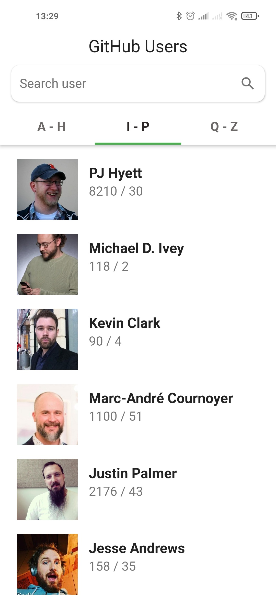
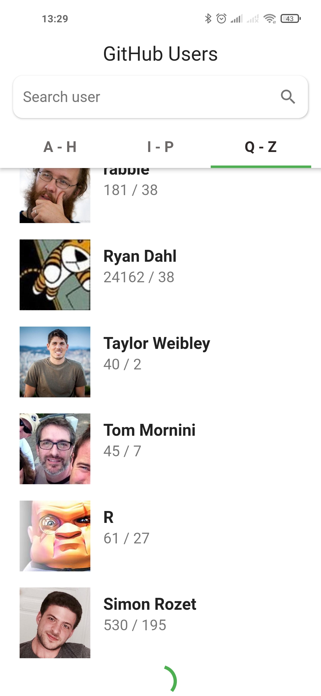
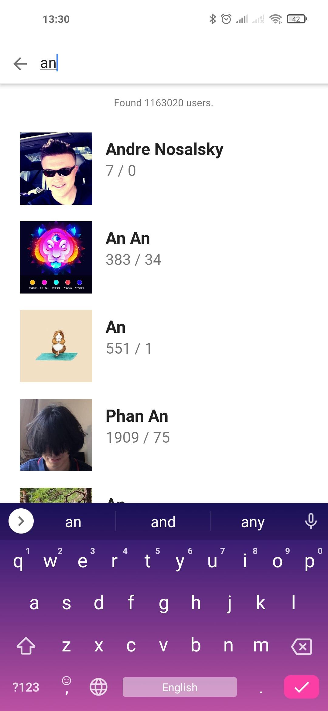
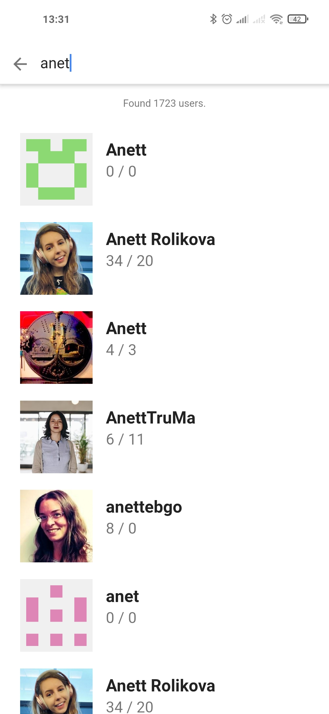
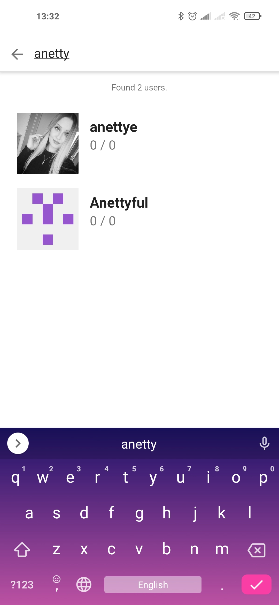

# GitHub Users

A Flutter application which displays a list of Github users, allows you to filter and search for users. It implements BLoC pattern.

**The main screen** of the app shows a list of users which is divided into **three tabs**. The first tab displays users, which names start from A-H letter, the second - from I to P and the third - from Q to Z. The user can switch between lists by swiping left and right or pressing the tabs. Each list item contains the following user data: avatar, name, number of followers, and following users.

  
  
  

The application loads the list of users in small chunks of 15 people using asynchronous requests to the [GitHub REST API](https://docs.github.com/en/rest). Then the users are filtered according to the current tab and displayed on the screen. Unfiltered users are saved in order to avoid repeated calls to API and load it quickly after switching to another tab. When the user reaches the end of the loaded list, another batch of 15 people starts loading and filtering, which we can see in the third screenshot above.

In order to find GitHub users by login, the user needs to click on the corresponding field at the top. **The search screen** opens. The search occurs as characters are entered with a delay of half a second to avoid frequent API calls. When searching, the data is loaded in parts to ensure the responsiveness of the interface. In addition to the list of found users, the number of found users is also displayed.

  
  
  

